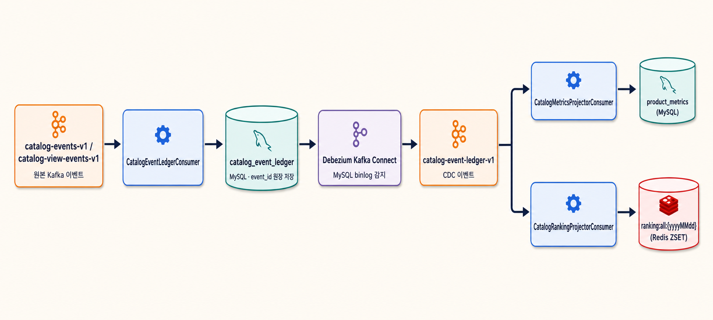

# Catalog Event Ledger와 CDC Projection

## 목적

Redis 일간 랭킹을 유일한 완전 상태로 두지 않고, 원본 상품 행동 이벤트를 append-only DB 원장에 보존한다. `product_metrics`와 Redis 랭킹은 원장을 CDC로 재생해 다시 만들 수 있는 projection으로 취급한다.

## 흐름



```text
catalog-events-v1 / catalog-view-events-v1
          │
          │ 원본 Kafka 이벤트
          ▼
CatalogEventLedgerConsumer
          │
          │ event_id 기준 원장 저장
          ▼
catalog_event_ledger (MySQL)
          │
          │ MySQL binlog 감지
          ▼
Debezium Kafka Connect
          │
          │ CDC 이벤트 발행
          ▼
catalog-event-ledger-v1
          │
          ├── CatalogMetricsProjectorConsumer
          │      └── product_metrics (MySQL)
          │
          └── CatalogRankingProjectorConsumer
                 └── ranking:all:{yyyyMMdd} (Redis ZSET)
```

두 projector는 서로 다른 consumer group을 사용하므로 CDC 이벤트를 각각 모두 받는다. CDC 토픽은 원장 commit 순서를 보존하기 위해 우선 단일 파티션으로 운영한다.

`product_metrics` 갱신과 Redis 랭킹 갱신 사이에는 `afterCommit` 관계가 없다. 두 projector는 같은 CDC 토픽을 서로 다른 consumer group으로 독립 소비하며, 각 저장소 반영이 성공한 뒤 자신의 offset만 ACK한다.

## 원장 멱등성

원장의 유일한 중복 판단 기준은 `event_id`다. `source_topic`, `source_partition`, `source_offset`은 추적 정보로만 저장하며 unique key로 사용하지 않는다.

원본 Kafka 배치가 재처리돼 동일한 `event_id`가 들어오면 `ON DUPLICATE KEY UPDATE id=id`로 기존 원장을 유지한다. 원장 row는 수정하거나 삭제하지 않는다.

## Projector 멱등성

- product metrics: 기존 `event_handled` 테이블로 DB 중복 갱신 방지
- ranking: 기존 `ranking:handled:{yyyyMMdd}` Redis SET과 Lua script로 중복 점수 방지

Debezium과 Kafka consumer는 at-least-once 전달이므로 두 멱등 장치를 유지한다.

## 로컬 실행

1. `docker/infra-compose.yml`로 MySQL, Kafka, Kafka Connect를 실행한다.
2. `docs/sql/catalog-event-ledger.sql`을 운영처럼 수동 적용하거나 local profile의 Hibernate DDL 생성을 사용한다.
3. Kafka Connect가 준비된 후 connector를 등록한다.

```bash
curl -X POST http://localhost:8083/connectors \
  -H "Content-Type: application/json" \
  --data @docker/debezium/catalog-event-ledger-connector.json
```

운영에서는 root 계정을 사용하지 말고 MySQL replication 권한만 가진 CDC 전용 계정으로 connector 설정을 교체해야 한다.

## Redis 복구

Redis가 재기동되거나 데이터가 유실되면 streamer가 오늘 날짜 원장을 PK 순서로 배치 조회해 랭킹을 자동 복구한다.

```text
복구 완료 마커와 랭킹/처리 이력 키 확인
  → 세 키가 모두 정상이면 복구 종료
  → 랭킹 또는 처리 이력 키가 유실됐으면 재복구
  → ranking:recovery:lock:{date} 분산 락 획득
  → 불완전한 랭킹/처리 이력 키 함께 초기화
  → catalog_event_ledger 오늘 이벤트를 id 기준 keyset pagination 조회
  → 기존 점수 정책으로 변환
  → RankingUpdater.applyEvents()로 ZINCRBY
  → ranking:recovery:completed:{date} 완료 마커 저장
```

완료 마커가 남아 있어도 랭킹 또는 처리 이력 키가 유실되면 원장에서 다시 복구한다. 실시간 CDC와 replay가 겹치더라도 `ranking:handled:{date}`의 event ID 멱등성 검사를 공유하므로 점수는 한 번만 반영된다. 여러 파드 중 하나만 복구하며, 중간에 Redis 오류가 나면 완료 마커를 새로 남기지 않아 다음 스케줄에서 다시 시도한다.

```yaml
ranking:
  recovery:
    enabled: true
    initial-delay: 30s
    fixed-delay: 1m
    batch-size: 1000
    lock-ttl: 30m
    marker-ttl: 2d
```
