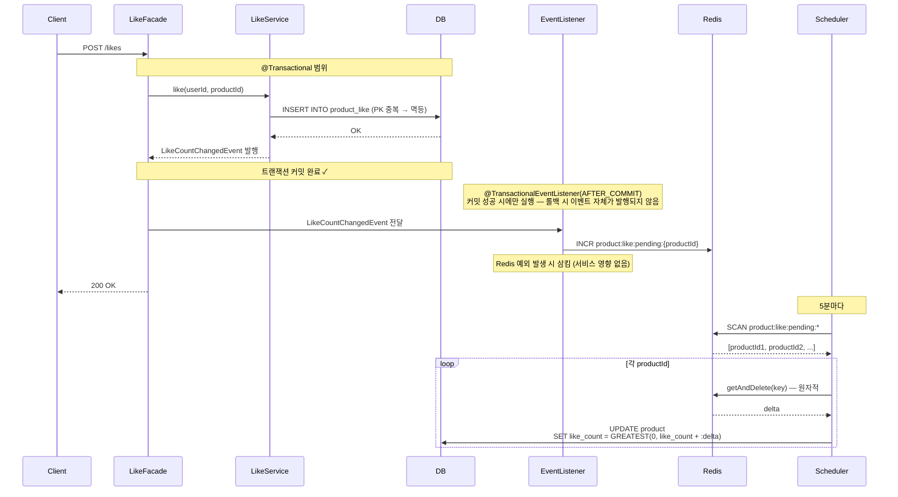

# Design Doc: 상품 조회 성능 최적화 및 좋아요 수 안정화

## Introduction & Goals

- **Context / Background**: 상품 목록 조회는 브랜드 필터 + 정렬(최신순·가격순·좋아요순) 조합이 다양하고 읽기 빈도가 높다. 10만 건 규모에서 인덱스 없이 풀 테이블 스캔이 발생해 부하 시 p(95) 응답이 985ms까지 치솟았다. 좋아요 기능은 같은 row에 대한 동시 UPDATE가 직렬화되어 DB row-level lock 경합이 발생하고, 반복적인 상품 조회가 매 요청마다 DB I/O를 유발해 트래픽 집중 시 커넥션 풀 고갈 위험이 있었다.

- **Goals**:
  1. 상품 목록 조회 p(95) 응답 시간 100ms 이하
  2. 좋아요 요청 시 DB row-level lock 경합 제거
  3. 반복 조회에 의한 DB I/O 감소 및 읽기 처리량 향상

---

## Detailed Design

### System Architecture

```
[Client]
    │
    ▼
[commerce-api]
    │
    ├── ProductService
    │       ├── ProductCacheRepository ──→ Redis  (Cache-Aside 읽기 캐시)
    │       └── adjustLikeCount()       ──→ MySQL (배치 반영)
    │
    ├── LikeCountEventListener          ──→ Redis INCR  (@TransactionalEventListener AFTER_COMMIT)
    │
    └── LikeCountSyncScheduler          ──→ Redis → MySQL  (5분마다 delta 반영)
```

### Data Models

**product 테이블 (관련 컬럼)**

| 컬럼 | 타입 | 설명 |
|---|---|---|
| id | BIGINT | PK |
| brand_id | BIGINT | 브랜드 FK |
| price | INT | 가격 |
| like_count | INT | 좋아요 수 (Redis delta 배치 반영) |
| deleted_at | DATETIME | 소프트 삭제 (NULL = 활성) |
| created_at | DATETIME | 생성 시각 |

**적용 인덱스**

| 인덱스명 | 컬럼 순서 | 커버 쿼리 |
|---|---|---|
| `idx_product_deleted_at_created_at` | (deleted_at, created_at) | 전체 최신순 |
| `idx_product_deleted_at_price` | (deleted_at, price) | 전체 가격순 |
| `idx_product_deleted_at_like_count` | (deleted_at, like_count) | 전체 좋아요순 |
| `idx_product_brand_id_deleted_at_created_at` | **(brand_id, deleted_at, created_at)** | 브랜드 + 최신순 |
| `idx_product_brand_id_deleted_at_price` | **(brand_id, deleted_at, price)** | 브랜드 + 가격순 |
| `idx_product_brand_id_deleted_at_like_count` | **(brand_id, deleted_at, like_count)** | 브랜드 + 좋아요순 |

브랜드 복합 인덱스에서 `brand_id`를 `deleted_at`보다 앞에 배치한 이유는 **카디널리티** 때문이다.

| 컬럼 | 선택도 |
|---|---|
| `deleted_at IS NULL` | 활성 데이터 비율에 따라 전체의 70~100% — 첫 분기에서 거의 좁혀지지 않음 |
| `brand_id = ?` | 브랜드 50개 기준 전체의 ~2% — 첫 분기에서 즉시 축소 |

두 컬럼이 모두 equality 조건이라 10만 건 규모에서 실측 차이는 오차 범위지만, 데이터가 수천만 건으로 늘어나거나 삭제 비율이 낮아질수록 카디널리티가 높은 `brand_id` 우선 설계가 확장성에서 유리하다.

**Redis 키 구조**

| 키 | TTL | 의미 |
|---|---|---|
| `product:like:pending:{productId}` | 없음 | 배치 미반영 likeCount delta |
| `product:cache:detail:{productId}` | 10분 | 상품 단건 조회 캐시 |
| `product:cache:list:{sort}:{brandId}:{page}:{size}` | 5분 | 상품 목록 조회 캐시 |

목록 캐시 TTL을 5분으로 설정한 이유: `LIKES_DESC` 정렬 기준인 `likeCount`가 배치 동기화 주기(5분)마다 갱신되므로 TTL을 배치 주기에 맞춰 stale 순위 노출 구간을 최소화했다.

### API Design

| Method | Path | 설명 |
|---|---|---|
| GET | `/api/v1/products` | 상품 목록 조회 (sort, brandId, page, size) |
| GET | `/api/v1/products/{productId}` | 상품 단건 조회 |
| POST | `/api/v1/products/{productId}/likes` | 좋아요 추가 |
| DELETE | `/api/v1/products/{productId}/likes` | 좋아요 취소 |

### 좋아요 수 반영 흐름

`@TransactionalEventListener(AFTER_COMMIT)`을 사용하여 DB 트랜잭션 커밋이 성공한 후에만 Redis를 업데이트한다. 롤백 시 이벤트 자체가 발행되지 않으므로 DB와 Redis 간 불일치를 방지한다.



`getAndDelete`를 사용하는 이유: delta를 읽는 동안에도 새로운 INCR이 들어올 수 있다. 값을 원자적으로 가져오고 즉시 키를 삭제하면 이후 INCR은 새 키에 누적되어 유실 없이 처리된다.

### Constraints

- `likeCount`는 최대 5분 지연될 수 있다. 목록 정렬 기준으로 사용되지만 실시간 정확도보다 DB 부하 감소를 우선했다.
- Redis 장애 시 미반영 delta가 유실될 수 있다. `ProductLike` 레코드는 DB에 즉시 저장되므로 실제 좋아요 수와의 불일치는 추후 보정 가능하다.
- 목록 캐시 무효화 시 SCAN 패턴 삭제를 수행한다. 현재 키 수가 적어 허용 범위지만 키가 많아지면 Redis 응답 지연이 발생할 수 있다.
- OFFSET 기반 페이지네이션은 deep pagination에서 인덱스를 추가해도 근본 해결이 안 된다. 커서 기반 페이지네이션 또는 Deferred Join으로 개선 가능하다.

---

## 성능 결과

> 테스트 데이터는 DataLoader를 구현해 상품 10만 건(소프트 삭제 30% 포함), 브랜드 50개를 사전 적재했다.

### 인덱스 최적화 (k6, VU=50, 30s, 10만 건)

| 쿼리 패턴 | 인덱스 없음 p(95) | 인덱스 추가 후 p(95) | 개선 |
|---|---|---|---|
| latest | 985ms | 88ms | 11배 |
| price_asc | 256ms | 87ms | 2.9배 |
| likes_desc | 241ms | 89ms | 2.7배 |
| 브랜드 + latest | 252ms | 53ms | 4.7배 |
| 처리량 (RPS) | 246 req/s | 591 req/s | 2.4배 |

### Cache-Aside (k6, VU=50, 20s, 10만 건)

| 시나리오 | p(95) | 비고 |
|---|---|---|
| 캐시 미스 (DB 조회) | 14.14ms | — |
| 캐시 히트 (Redis) | 5.65ms | **약 2.5배 빠름** |

---

## Alternatives Considered

### 1. 상품 목록 인덱스 설계

| 옵션 | Pros | Cons |
|---|---|---|
| A. 인덱스 없음 | 쓰기 오버헤드 없음 | 풀 테이블 스캔. 부하 시 p(95) 985ms, 처리량 246 RPS |
| B. `(deleted_at, brand_id, ...)` 순서 | 구성 단순 | `deleted_at IS NULL`이 전체의 70~100%를 포함 — 첫 분기에서 거의 좁혀지지 않음. 대용량·저삭제율 환경에서 불리 |
| **선택: C. `(brand_id, deleted_at, ...)` 순서** | 첫 분기에서 ~2%까지 즉시 축소. 대용량 환경 확장성 우수 | 브랜드 필터 없는 전체 조회는 별도 인덱스 필요 (이미 구성함) |

**선택 근거:** 실측 성능은 두 순서 모두 차이가 없었다.

| 쿼리 | `(brand_id, deleted_at, ...)` | `(deleted_at, brand_id, ...)` |
|---|---|---|
| 브랜드 + latest | 0.286ms | 0.292ms |
| 브랜드 + price_asc | 0.485ms | 0.397ms |
| 브랜드 + likes_desc | 0.461ms | 0.418ms |

차이가 0.1ms 이내로 오차 범위 수준이다. 두 컬럼이 모두 equality 조건이면 B-Tree는 탐색 순서와 무관하게 동일한 노드 수를 읽기 때문이다. 그럼에도 `(brand_id, deleted_at, ...)`을 선택한 이유는, 성능이 같다면 이론적으로 올바른 방향을 선택하는 것이 낫기 때문이다. `deleted_at IS NULL`은 활성 데이터 비율에 따라 수렴 범위가 크게 달라지는 반면, `brand_id = ?`는 브랜드 수에 비례해 항상 일정하게 좁혀진다. 데이터가 수천만 건으로 늘어나거나 삭제 비율이 낮아질수록 이 차이가 실측에서도 드러나기 시작하므로, 지금 올바른 순서를 잡아두는 것이 낫다고 판단했다.

**DESC 인덱스 추가 여부 검토**

`latest` / `likes_desc` 정렬은 DESC 순서로 조회하므로 ASC 인덱스를 역방향으로 읽는 `Backward index scan`이 발생한다. DESC 인덱스를 명시하면 Forward scan으로 전환되어 이 레이블이 사라지기 때문에 성능 개선 여지가 있는지 측정했다.

| 쿼리 | ASC 인덱스 (Backward scan) | DESC 인덱스 |
|---|---|---|
| latest — 1페이지 | 0.154ms | 0.139ms |
| likes_desc — 1페이지 | 0.483ms | 0.558ms |
| latest — OFFSET 40,000 | 36.1ms | 35.7ms |
| likes_desc — OFFSET 40,000 | 142ms | 144ms |

shallow pagination에서 차이가 오차 범위고, deep pagination에서도 DESC 인덱스가 더 빠르지 않았다. deep pagination의 실제 병목은 **scan 방향이 아니라 OFFSET 자체**다. `LIMIT 20 OFFSET 40000`은 ASC든 DESC든 40,020개를 순회하고 버리는 비용이 동일하다. DESC 인덱스를 추가해도 읽는 행 수가 줄지 않으므로 이득이 없다.

→ **DESC 인덱스를 추가하지 않기로 결정.** deep pagination 근본 해결은 커서 기반 페이지네이션 또는 Deferred Join으로 접근해야 한다.

---

### 2. 좋아요 수(likeCount) 관리

> **집계 테이블을 따로 만들지 않은 이유**  
> 집계 전용 테이블은 조회수·구매수·평점 등 여러 지표를 하나의 테이블에 모아 관리할 때 의미가 있다.  
> 현재 시스템에서 배치로 관리할 수치는 `likeCount` **단 하나**다.  
> 하나의 컬럼을 위해 테이블을 분리하면 JOIN 비용만 추가될 뿐, **같은 row에 UPDATE가 집중되는 경합 문제는 그대로 남는다.**

| 옵션 | Pros | Cons |
|---|---|---|
| A. 매 요청 원자적 UPDATE | 즉시 정합성 보장, 구현 단순 | 동시 요청이 같은 row에 집중 → lock 경합 그대로 존재. 고트래픽에서 DB 부하 선형 증가 |
| B. 집계 테이블 분리 (`product_like_count`) | `product` 테이블 lock 범위 축소 | 집계 테이블도 동일 row에 UPDATE가 집중 → lock 경합 근본 해결 안 됨. 집계 대상이 likeCount 하나뿐이라 분리 이득 없음 |
| **선택: C. Redis INCR 버퍼링 + 배치 동기화** | Redis INCR은 단일 스레드 원자적 연산 → DB lock 없음. 쓰기 부하를 5분 주기 배치로 분산 | likeCount 최대 5분 지연. Redis 장애 시 미반영 delta 유실 가능 |

**선택 근거:** lock 경합을 근본적으로 없애려면 쓰기 경로를 DB에서 Redis로 옮겨야 한다. 집계 테이블 분리는 lock 범위를 좁힐 뿐이고, 집계 대상이 `likeCount` 단일 컬럼인 현재 구조에서 분리 이득이 없다. Redis INCR은 lock 없이 원자성을 보장하며, `@TransactionalEventListener(AFTER_COMMIT)`으로 DB 롤백 시 Redis 업데이트를 방지해 불일치를 차단한다.

---

### 3. 상품 조회 캐싱 전략

| 옵션 | Pros | Cons |
|---|---|---|
| A. Write-Through | 쓰기 시점에 캐시 즉시 갱신, 캐시 미스 없음 | 읽히지 않을 데이터도 캐싱. 쓰기 경로가 복잡해짐 |
| **선택: B. Cache-Aside (Read-Through + Eviction)** | 실제로 읽히는 데이터만 캐싱. Redis 장애 시 DB 폴백으로 가용성 유지 | 캐시 미스 시 첫 요청은 DB 조회. 쓰기 후 evict와 새 캐싱 사이에 짧은 stale 구간 존재 |

**선택 근거:** 상품 데이터는 읽기 빈도는 높고 변경 빈도는 낮다. Cache-Aside는 실제로 조회되는 데이터만 캐싱해 메모리를 효율적으로 사용하고, 수정·삭제 시 evict로 정합성을 즉시 보장한다. Redis 장애 시 DB 폴백으로 서비스 가용성을 유지한다.

**TTL 및 만료 전략**

| 키 | TTL | 설계 근거 |
|---|---|---|
| `product:cache:detail:{productId}` | 10분 | 상품 정보 변경 빈도가 낮고, 수정·삭제 시 evict로 즉시 무효화하므로 TTL은 안전망 역할 |
| `product:cache:list:{sort}:{brandId}:{page}:{size}` | 5분 | `LIKES_DESC` 정렬 기준인 `likeCount`가 배치 주기(5분)마다 갱신되므로 TTL을 배치 주기에 맞춤 |

evict 시점은 다음과 같다.

| 이벤트 | 삭제 대상 |
|---|---|
| 상품 생성 | 목록 캐시 전체 (`product:cache:list:*`) |
| 상품 수정 | 상세 캐시 1건 + 목록 캐시 전체 |
| 상품 삭제 | 상세 캐시 1건 + 목록 캐시 전체 |

목록 캐시는 sort·brandId·page·size 조합이 다양하므로 개별 키 추적 대신 패턴 전체를 SCAN으로 삭제한다. `likeCount` 변경은 배치 반영이므로 evict 대상에서 제외하고 TTL 만료로 자연 갱신한다.