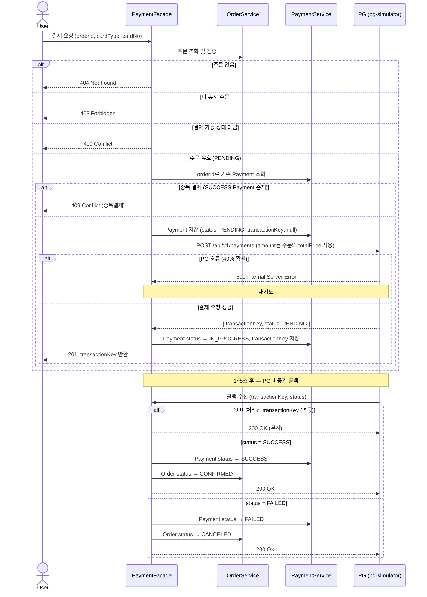

# 외부 결제 연동 설계 (PG-Simulator)

## 개요

- `pg-simulator`를 외부 결제 시스템(PG: Payment Gateway)으로 간주하고 `commerce-api`와의 연동 방식을 정의한다.
- 결제는 **주문 생성과 분리된 독립 기능**이다. 유저는 생성된 주문에 대해 별도로 결제를 요청한다.
- PG는 **비동기 콜백 방식**으로 결제 결과를 통보한다. 요청 즉시 `PENDING` 상태를 응답하고, 1~5초 후 `callbackUrl`로 최종 결과를 전달한다.

---

## commerce-api 결제 API 스펙

### [PAYMENT-001] 결제 요청 `POST /api/v1/payments`

**Request**

```http
POST /api/v1/payments
X-Loopers-LoginId: {loginId}
X-Loopers-LoginPw: {loginPw}
Content-Type: application/json

{
  "orderId": "1351039135",
  "cardType": "SAMSUNG",
  "cardNo": "1234-5678-9814-1451"
}
```

| 필드 | 타입 | 제약 |
|---|---|---|
| `orderId` | String | 결제 대상 주문 ID |
| `cardType` | Enum | `SAMSUNG` / `KB` / `HYUNDAI` |
| `cardNo` | String | `xxxx-xxxx-xxxx-xxxx` 형식 |

- `amount`는 주문의 `totalPrice`를 사용한다 (클라이언트에서 직접 전달하지 않음)
- `callbackUrl`은 commerce-api 내부에서 고정값으로 설정한다 (`http://localhost:8080/api/v1/payments/callback`)

**Response**

```json
{
  "transactionKey": "20260621:TR:9577c5",
  "status": "PENDING"
}
```

**기능 흐름**

1. `X-Loopers-LoginId` / `X-Loopers-LoginPw` 헤더로 유저를 식별한다.
    - 헤더가 없거나 불일치하면 `401` 반환
2. `orderId`로 주문을 조회한다.
    - 존재하지 않으면 `404` 반환
    - 요청 유저의 주문이 아니면 `403` 반환
    - 주문 상태가 `PENDING`이 아니면 `409` 반환
3. `orderId`로 기존 Payment를 조회한다.
    - `SUCCESS` 상태의 Payment가 존재하면 `409` 반환 (중복 결제)
4. `Payment` 레코드를 저장한다 (`status: PENDING`, `transactionKey: null`).
5. PG에 결제를 요청한다.
    - 주문의 `totalPrice`를 결제 금액으로 사용
    - PG 오류(`500`) 시 재시도, 최대 N회 실패 시 `503` 반환
6. PG로부터 `transactionKey`를 수신한다.
7. `Payment` 상태를 `IN_PROGRESS`로 전환하고 `transactionKey`를 저장한다.
8. `201` 응답과 함께 `transactionKey`를 반환한다.

---

## PG 인터페이스 스펙

### 공통

| 항목 | 값 |
|---|---|
| 베이스 URL | `http://localhost:8082` |
| 인증 헤더 | `X-USER-ID: {userId}` |

### 결제 요청 `POST /api/v1/payments`

**Request Body**

```json
{
  "orderId": "1351039135",
  "cardType": "SAMSUNG",
  "cardNo": "1234-5678-9814-1451",
  "amount": 5000,
  "callbackUrl": "http://localhost:8080/api/v1/payments/callback"
}
```

**Response Body**

```json
{
  "transactionKey": "20260621:TR:9577c5",
  "status": "PENDING",
  "reason": null
}
```

**PG 서버 특성**

- 요청 처리에 100~500ms 지연 존재
- **40% 확률로 `500 INTERNAL_ERROR` 즉시 반환** → 재시도 필요

### PG 콜백 페이로드

결제 처리 완료 후 PG가 `callbackUrl`로 `POST` 요청을 전송한다.

```json
{
  "transactionKey": "20260621:TR:9577c5",
  "orderId": "1351039135",
  "cardType": "SAMSUNG",
  "cardNo": "1234-5678-9814-1451",
  "amount": 5000,
  "status": "SUCCESS",
  "reason": "정상 승인되었습니다."
}
```

| `status` | 사유 | 비율 |
|---|---|---|
| `SUCCESS` | 정상 승인 | 70% |
| `FAILED` | 한도초과 | 20% |
| `FAILED` | 잘못된 카드 | 10% |

---

## 전체 연동 플로우



---

## 콜백 엔드포인트 설계

### [PAYMENT-CALLBACK] `POST /api/v1/payments/callback`

| 항목 | 내용 |
|---|---|
| 호출 주체 | PG (pg-simulator) |
| 인증 | 없음 (PG 내부 호출) |
| 멱등성 | `transactionKey` 기준으로 이미 처리된 건은 무시 |

**처리 흐름**

1. `transactionKey`로 `Payment`를 조회한다.
    - 존재하지 않으면 `404` 반환
2. 이미 `SUCCESS` / `FAILED` 상태이면 `200` 반환 (중복 콜백 무시)
3. `status = SUCCESS` → `Payment.status = SUCCESS`, `Order.status = CONFIRMED`
4. `status = FAILED` → `Payment.status = FAILED`, `Order.status = CANCELED`

---

## Payment 상태 정의

| 상태 | 의미 | 전환 조건 |
|---|---|---|
| `PENDING` | Payment 생성 직후, PG 호출 전 | 최초 생성 시 |
| `IN_PROGRESS` | PG 호출 성공, 콜백 대기 중 | PG로부터 `transactionKey` 수신 시 |
| `SUCCESS` | 결제 성공 | PG 콜백 `status=SUCCESS` 수신 시 |
| `FAILED` | 결제 실패 | PG 콜백 `status=FAILED` 수신 시 |
| `ABANDONED` | 배치가 폴링 후 포기 | `PENDING` 또는 `IN_PROGRESS` 상태에서 배치 최대 조회 횟수 초과 시 |

배치는 `PENDING` / `IN_PROGRESS` 상태의 Payment를 주기적으로 폴링하여 콜백 미수신 건을 보완한다.

---

## 실패 시나리오 및 대응

| 시나리오 | 원인 | 대응 |
|---|---|---|
| PG 요청 즉시 실패 | 서버 불안정 (40% 확률) | 최대 N회 재시도 후 실패 시 `503` 반환 |
| 콜백 미수신 | 네트워크 단절 또는 PG 처리 지연 | PG 조회 API 폴링으로 보완 가능 (별도 배치) |
| 콜백 중복 수신 | PG 재전송 | `transactionKey` 기준 멱등 처리 |

---

## 트랜잭션 경계

```
[결제 요청]
  유저 인증 + 주문 조회/검증 + 중복 결제 확인
  Payment INSERT (PENDING, transactionKey=null)
  ──────────────── COMMIT

  ── PG HTTP 호출 (트랜잭션 외부) ──

  Payment UPDATE (IN_PROGRESS, transactionKey 세팅)
  ──────────────── COMMIT

[콜백 수신]
  Payment 상태 업데이트 (SUCCESS / FAILED)
  Order 상태 업데이트 (CONFIRMED / CANCELED)
  ──────────────── COMMIT

[배치 폴링]
  PENDING / IN_PROGRESS Payment 조회
  PG 조회 API 호출
  Payment 상태 업데이트 (SUCCESS / FAILED / ABANDONED)
  ──────────────── COMMIT (건별)
```

- PG HTTP 호출은 트랜잭션 외부에서 수행한다.
- 콜백 수신 시 `Payment`와 `Order` 상태 업데이트는 하나의 트랜잭션으로 처리한다.
