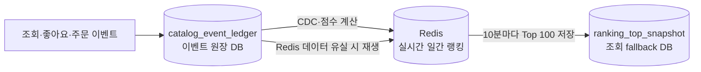
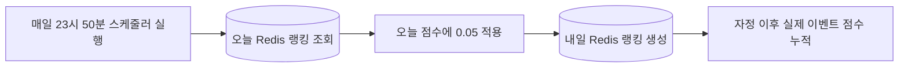
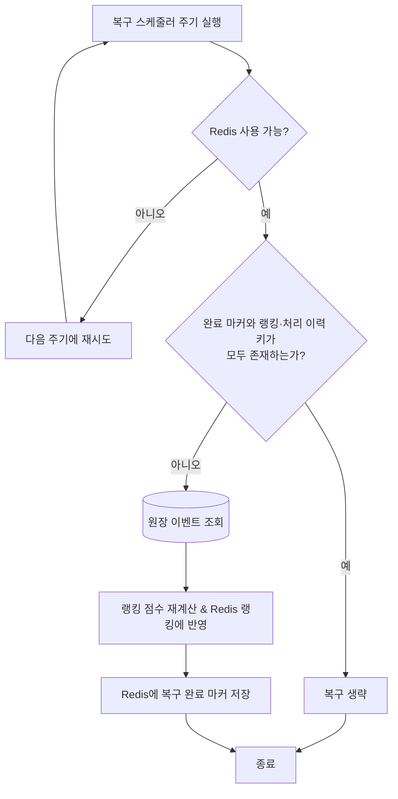

# 실시간 상품 랭킹 시스템 동작 가이드

## 1. 문서 목적

이 문서는 현재 브랜치에 구현된 일간 상품 랭킹 시스템의 실제 동작을 설명한다.

다음 내용을 다룬다.

- 조회·좋아요·주문 이벤트가 발행되는 과정
- Kafka 배치 컨슈머가 이벤트를 처리하는 과정
- 이벤트 발생일을 기준으로 Redis ZSET을 선택하는 방식
- DB와 Redis의 멱등성 책임 분리
- Redis 장애 및 Kafka 재처리 시 동작
- 랭킹 조회 API와 상품 상세 순위 조회
- TTL과 다음 날 랭킹 carry-over
- 현재 지원 범위와 테스트 방법

## 2. 전체 구조

```text
commerce-api
  ├─ 주문 완료 / 좋아요 / 좋아요 취소
  │    └─ Outbox 저장 → catalog-events-v1 발행
  │
  └─ 상품 상세 조회
       └─ catalog-view-events-v1 직접 발행

Kafka
  ├─ catalog-events-v1
  ├─ catalog-view-events-v1
  └─ catalog-event-ledger-v1

commerce-streamer
  ├─ 원본 이벤트를 catalog_event_ledger에 저장
  ├─ CDC 토픽의 metrics projector → product_metrics 갱신
  └─ CDC 토픽의 ranking projector → Redis Lua 실행
       ├─ ranking:handled:{yyyyMMdd} 중복 확인
       └─ ranking:all:{yyyyMMdd} 점수 누적

commerce-api
  ├─ GET /api/v1/rankings
  └─ GET /api/v1/products/{productId}
```

### 2.1 Data Model



#### 이벤트 원장 DB — `catalog_event_ledger`

| 컬럼 | 타입 | 역할 |
|---|---|---|
| `id` | BIGINT, PK, AUTO_INCREMENT | 원장 조회 및 복구 배치의 순서 |
| `event_id` | VARCHAR(100), UNIQUE | 이벤트 중복 적재 방지 |
| `event_type` | VARCHAR(100) | 조회·좋아요·주문 등 이벤트 구분 |
| `occurred_at` | DATETIME(6), INDEX | 이벤트 발생일 기준 랭킹 선택 및 복구 범위 |
| `received_at` | DATETIME(6) | streamer가 이벤트를 수신한 시각 |
| `payload` | JSON | 상품 ID와 주문 금액 등 점수 재계산 원본 |
| `source_topic` | VARCHAR(255) | 원본 Kafka 토픽 |
| `source_partition` | INT | 원본 Kafka 파티션 |
| `source_offset` | BIGINT | 원본 Kafka offset |
| `event_version` | INT | 이벤트 스키마 버전 |

이 테이블은 Redis 장애와 데이터 유실에 대비한 영속 원본이다. Redis 복구 시 해당 날짜의 원장 이벤트를 읽어 점수를 다시 계산한다.

#### Top-100 snapshot DB — `ranking_top_snapshot`

| 컬럼 | 타입 | 역할 |
|---|---|---|
| `ranking_date` | DATE, PK | 랭킹 날짜 |
| `rank_position` | INT, PK | 해당 날짜의 순위 1~100 |
| `product_id` | BIGINT, INDEX | 상품 식별자 및 단건 순위 fallback 조회 |
| `score` | DOUBLE | 스냅샷 생성 당시 점수 |
| `snapshotted_at` | DATETIME(6) | 마지막 정상 스냅샷 시각 |

`(ranking_date, rank_position)`을 복합 PK로 사용한다. commerce-api가 Redis의 오늘 랭킹 Top 100을 기본 10분마다 날짜 단위 트랜잭션으로 교체하며, Redis 조회 장애 시 마지막 정상 스냅샷을 제공한다.

#### Redis 키 전략

| 키 | 타입 | 값 | TTL | 역할 |
|---|---|---|---:|---|
| `ranking:all:{yyyyMMdd}` | ZSET | member=`productId`, score=누적 랭킹 점수 | 2일 | 날짜별 실시간 랭킹 |
| `ranking:handled:{yyyyMMdd}` | SET | member=`eventId` | 2일 | Kafka 재처리와 원장 재생의 중복 점수 방지 |
| `ranking:recovery:lock:{yyyy-MM-dd}` | STRING | 복구 실행 owner UUID | 기본 30분 | 여러 파드의 동시 원장 복구 방지 |
| `ranking:recovery:completed:{yyyy-MM-dd}` | STRING | `1` | 기본 2일 | 복구 완료 기록. 랭킹 키와 처리 이력 키가 정상일 때만 복구 생략 |
| `ranking:carry-over:{yyyy-MM-dd}` | STRING | 실행 token UUID | 1일 | 여러 파드의 동시 carry-over 방지 |

랭킹 ZSET과 처리 이력 SET은 하나의 Lua script에서 함께 갱신한다. 복구 완료 마커가 있어도 두 데이터 키 중 하나가 유실되면 불완전한 키를 초기화하고 이벤트 원장에서 다시 복구한다.

## 3. Redis 키 구조

### 3.1 일간 랭킹 ZSET

```text
KEY    ranking:all:{yyyyMMdd}
TYPE   ZSET
MEMBER productId 문자열
SCORE  이벤트 점수 누적값
TTL    2일
```

예시:

```text
ranking:all:20260713

member=101, score=12.4
member=205, score=8.7
```

점수가 높은 상품이 상위에 위치한다. API에서는 `ZREVRANGE` 및 `ZREVRANK`를 사용하므로 순위는 점수 내림차순이다.

### 3.2 Redis 이벤트 처리 집합

```text
KEY    ranking:handled:{yyyyMMdd}
TYPE   SET
MEMBER eventId
TTL    2일
```

이 키는 같은 이벤트가 Kafka에서 재전달되더라도 ZSET 점수가 중복 적립되지 않게 한다.

랭킹 키와 이벤트 처리 키는 `RankingKeys`를 통해 생성하므로 commerce-api와 commerce-streamer가 동일한 포맷을 사용한다.

## 4. 이벤트별 점수

가중치는 commerce-streamer의 `application.yml`에 정의된다.

```yaml
ranking:
  weight:
    view: 0.1
    like: 0.2
    order: 0.6
```

점수 계산식은 다음과 같다.

```text
상품 조회      +0.1
좋아요         +0.2
좋아요 취소    -0.2
주문           0.6 × log10(1 + 상품 주문금액)
```

상품 주문금액은 다음과 같이 계산한다.

```text
상품 단가 × 주문 수량
```

주문 이벤트는 상품별 `productAmountMap`을 포함한다. 주문 금액에 로그 정규화를 적용해 고가 상품 하나가 랭킹 점수를 지나치게 독점하는 현상을 완화한다.

현재 가중치는 설정 파일을 수정한 후 애플리케이션을 재시작해야 반영된다. 실행 중 동적 변경 기능은 구현되어 있지 않다.

## 5. 이벤트 발행

### 5.1 주문·좋아요 이벤트

주문 완료, 좋아요, 좋아요 취소는 `UserActionEvent`를 거쳐 Outbox에 저장된다.

Outbox 발행 스케줄러는 `catalog-events-v1`으로 이벤트를 전송하면서 다음 Kafka header를 추가한다.

```text
X-Event-Type
X-Event-Id
X-Event-Occurred-At
```

이벤트 종류와 payload는 다음과 같다.

| 사용자 행동 | Event Type | 주요 payload |
|---|---|---|
| 주문 완료 | `OrderItemSoldEvent` | `orderId`, `productQtyMap`, `productAmountMap` |
| 좋아요 | `ProductLikedEvent` | `productId` |
| 좋아요 취소 | `ProductUnlikedEvent` | `productId` |

`X-Event-Occurred-At`에는 Outbox 이벤트 생성 시각이 들어간다.

### 5.2 상품 조회 이벤트

`GET /api/v1/products/{productId}`가 성공하면 상품 조회 이벤트가 `catalog-view-events-v1`으로 직접 발행된다.

payload 예시:

```json
{
  "eventId": "8f852101-7da8-4595-a46d-0749fa178ef6",
  "occurredAt": "2026-07-13T14:30:00+09:00[Asia/Seoul]",
  "productId": 101
}
```

조회 이벤트도 `eventId`와 `occurredAt`을 포함하므로 재처리 중복 방지와 발생일 기준 적재가 가능하다.

구버전 조회 이벤트에 해당 필드가 없으면 다음 값을 사용한다.

- eventId: `{topic}:{partition}:{offset}`
- occurredAt: Kafka record timestamp
- Kafka timestamp도 없으면 commerce-streamer의 현재 시각

## 6. Kafka 배치 소비

원장 컨슈머와 두 CDC projector 모두 `KafkaConfig.BATCH_LISTENER`를 사용한다.

```text
max.poll.records = 3000
ack mode         = MANUAL
concurrency      = 3
```

### 6.1 원장 및 product_metrics projector

`CatalogEventLedgerConsumer`가 원본 토픽을 원장에 저장하고, `CatalogMetricsProjectorConsumer`가 `catalog-event-ledger-v1`을 소비한다.

처리 순서는 다음과 같다.

```text
1. 원본 Kafka header와 payload를 원장 모델로 정규화
2. catalog_event_ledger 저장 후 원본 offset ack
3. Debezium이 catalog-event-ledger-v1 발행
4. metrics projector가 event_handled로 DB 처리 여부 확인
5. 미처리 이벤트이면 product_metrics 갱신 및 event_handled 저장
6. metrics projector offset ack
```

product_metrics와 Redis 랭킹은 서로 다른 consumer group에서 독립적으로 처리한다.

### 6.2 랭킹 projector

`CatalogRankingProjectorConsumer`는 `catalog-event-ledger-v1`을 소비한다.

처리 순서는 다음과 같다.

```text
1. CDC 원장 row에서 eventId, eventType, occurredAt, payload 파싱
2. 이벤트 발생일별 RankingEventScore 목록 구성
3. 날짜별 Redis Lua 실행
4. Redis 반영 성공 후 Kafka offset ack
```

Redis 반영 예외가 발생하면 ack가 호출되지 않아 ranking projector consumer group이 해당 CDC 이벤트를 재처리한다.

## 7. 이벤트 날짜 결정

랭킹 날짜는 소비 시각이 아니라 이벤트 발생 시각을 사용한다.

예를 들어 다음 이벤트가 있다고 가정한다.

```text
이벤트 발생: 2026-07-12 23:59:59 KST
Kafka 소비: 2026-07-13 00:00:03 KST
```

이 이벤트는 다음 키에 적립된다.

```text
ranking:all:20260712
```

날짜 결정 우선순위는 다음과 같다.

```text
1. X-Event-Occurred-At 또는 payload occurredAt
2. Kafka record timestamp
3. commerce-streamer 현재 날짜
```

시각은 `Asia/Seoul` 기준 날짜로 변환한다.

## 8. DB와 Redis의 멱등성 책임

DB와 Redis는 서로 다른 저장소이므로 각각 자신의 중복 처리를 담당한다.

| 저장소 | 멱등성 저장 위치 | 보호하는 데이터 |
|---|---|---|
| MySQL | `event_handled` 테이블 | `product_metrics` 중복 갱신 방지 |
| Redis | `ranking:handled:{yyyyMMdd}` SET | 랭킹 ZSET 중복 점수 방지 |

### 8.1 DB에서 이미 처리된 이벤트

DB에서 `eventId`가 이미 처리된 것으로 확인되면 `product_metrics`는 다시 갱신하지 않는다.

하지만 랭킹 점수 델타는 다시 계산해 Redis로 전달한다.

```text
DB event_handled 존재
→ DB metrics 갱신 생략
→ 랭킹 델타 반환
→ Redis Lua가 Redis 처리 여부 판단
```

DB 처리 여부만 보고 Redis 호출을 생략하면 DB 성공 후 Redis 실패 상황을 복구할 수 없기 때문이다.

### 8.2 Redis Lua 멱등 처리

Redis에서는 이벤트 처리 기록과 점수 증가를 하나의 Lua script로 실행한다.

개념적인 동작은 다음과 같다.

```lua
if redis.call('SADD', handledKey, eventId) == 1 then
    redis.call('ZINCRBY', rankingKey, delta, productId)
end
```

- `SADD` 결과가 1이면 처음 처리하는 이벤트이므로 점수를 반영한다.
- `SADD` 결과가 0이면 이미 처리한 이벤트이므로 점수를 반영하지 않는다.
- 이벤트 ID 등록과 모든 상품 점수 증가는 하나의 Lua 실행 안에서 원자적으로 처리된다.

주문 하나에 여러 상품이 포함된 경우에도 해당 이벤트의 상품별 점수를 같은 Lua 실행에서 처리한다.

## 9. 장애 및 재처리 동작

### 9.1 정상 처리

```text
DB metrics 반영
→ Redis eventId 등록 및 ZSET 반영
→ Kafka ack
```

### 9.2 DB 성공 후 Redis 실패

```text
DB metrics 반영 성공
→ Redis 연결 실패
→ 예외 전파
→ Kafka ack 미호출
→ Kafka 이벤트 재전달
```

재처리 시에는 다음과 같이 동작한다.

```text
DB event_handled 존재
→ DB metrics 갱신 생략
→ 랭킹 델타 재생성
→ Redis 반영 재시도
→ 성공 후 ack
```

따라서 Redis의 일시 장애 때문에 랭킹 점수를 바로 유실하지 않는다.

### 9.3 Redis 성공 후 ack 전 애플리케이션 종료

Kafka는 ack되지 않은 이벤트를 다시 전달한다.

재처리 시 Redis의 `ranking:handled:{date}`에 eventId가 이미 있으므로 Lua가 `ZINCRBY`를 실행하지 않는다.

```text
이벤트 재전달
→ Redis SADD 결과 0
→ 점수 중복 적립 없음
→ ack
```

### 9.4 잘못된 개별 메시지

payload 파싱이나 필수 값 처리에 실패한 개별 메시지는 DLQ로 전송한다. 정상 메시지는 계속 처리하고 배치 마지막에 ack한다.

Redis 랭킹 반영 실패는 개별 메시지 오류로 취급하지 않는다. Redis 예외는 배치 밖으로 전파해 전체 배치를 재처리한다.

## 10. TTL

새 이벤트가 반영되면 다음 두 키에 2일 TTL을 설정한다.

```text
ranking:all:{yyyyMMdd}
ranking:handled:{yyyyMMdd}
```

TTL은 새로운 이벤트가 실제 적용된 경우 갱신된다. 동일 eventId만 재수신되어 아무 점수도 반영되지 않은 경우에는 TTL을 불필요하게 연장하지 않는다.

이 정책상 일반적인 조회 범위는 오늘과 전날이다. 만료된 날짜를 API로 조회하면 빈 결과가 반환된다.

## 11. 콜드 스타트 완화

commerce-streamer의 스케줄러는 매일 23시 50분에 실행된다.



```text
오늘 ZSET 전체 점수 × 0.05
→ 내일 ranking:all:{yyyyMMdd} 생성
→ 내일 키 TTL 2일 설정
```

Lua script에서 원자적으로 실행하는 개념적인 Redis 연산:

```text
SET ranking:carry-over:{오늘} token NX EX 86400
ZRANGE ranking:all:{오늘} 0 -1 WITHSCORES
ZADD ranking:all:{내일} score*0.05 productId
```

특징:

- 오늘 랭킹이 비어 있으면 내일 키를 생성하지 않는다.
- 내일 키가 이미 있으면 실행하지 않는다.
- 여러 파드가 동시에 스케줄을 실행해도 Redis `SET NX` 락을 획득한 한 파드만 처리한다.
- 락 획득, 전체 랭킹 조회, 내일 키 생성과 TTL 설정은 하나의 Lua script로 실행된다.
- 자정 직후 랭킹이 완전히 비어 있는 문제를 완화한다.
- 자정 이후 발생한 실제 이벤트 점수는 carry-over 점수 위에 누적된다.

## 12. 랭킹 API

### 12.1 랭킹 페이지 조회

```http
GET /api/v1/rankings?date=yyyyMMdd&page=1&size=20
```

파라미터:

| 이름 | 필수 | 기본값 | 설명 |
|---|---:|---:|---|
| `date` | 아니오 | 오늘 | `yyyyMMdd` 형식 |
| `page` | 아니오 | 1 | 1부터 시작 |
| `size` | 아니오 | 20 | 1~100 |

처리 과정:

```text
1. Redis ZREVRANGE WITHSCORES로 해당 페이지 조회
2. 상품 ID 목록을 DB에서 한 번에 조회
3. ZSET 순서를 유지하며 상품정보 결합
4. ZCARD로 totalCount 조회
```

응답 예시:

```json
{
  "meta": {
    "result": "SUCCESS"
  },
  "data": {
    "date": "20260713",
    "totalCount": 2,
    "items": [
      {
        "rank": 1,
        "productId": 101,
        "name": "상품 A",
        "price": 12000,
        "likeCount": 34
      }
    ]
  }
}
```

삭제된 상품은 상품정보 결합 단계에서 응답 목록에서 제외된다. 다만 Redis ZSET의 원래 순위와 `totalCount`는 유지된다.

### 12.2 상품 상세 순위

```http
GET /api/v1/products/{productId}
```

상품 상세 조회 시 오늘 랭킹 ZSET에서 `ZREVRANK`를 조회한다.

```text
Redis ZREVRANK 결과 + 1 → API rank
```

- 랭킹에 있으면 1부터 시작하는 `rank` 반환
- 랭킹에 없으면 `rank: null`
- 상품 상세 조회 성공 후 조회 이벤트 발행

## 13. 현재 지원하지 않는 기능

다음 기능은 현재 구현 범위에 포함되지 않는다.

- 시간 단위 랭킹 키
- 실행 중 가중치 동적 변경
- 만료된 랭킹의 장기 보관
- 삭제 상품을 Redis ZSET에서 자동 제거하는 정리 작업

## 14. Redis 조회 장애 시 Top-N fallback

- commerce-api는 오늘 랭킹의 Top 100을 기본 10분 간격으로 `ranking_top_snapshot`에 저장한다. 별도 활성화 플래그 없이 상시 동작한다.
- 스냅샷 교체는 날짜 단위 DB 트랜잭션으로 실행된다.
- Redis 연결 또는 시스템 예외가 발생하면 마지막 정상 스냅샷에서 목록, 단건 순위, 개수를 조회한다.
- fallback은 저장된 Top-N 범위까지만 제공하며, Top-N 바깥 페이지나 상품은 빈 결과가 정상이다. fallback 중 totalCount는 스냅샷 보유 수(최대 Top-N)를 의미한다.
- Redis 조회가 비어 있거나 스냅샷 갱신이 실패하면 기존 정상 스냅샷을 유지한다.
- 운영 환경에서는 `docs/sql/ranking-top-snapshot.sql`을 먼저 적용해야 한다.

```yaml
ranking:
  fallback-snapshot:
    top-n: 100
    interval-ms: 600000
```

### 14.1 Redis 전체 장애와 원장 기반 복구 흐름



`RankingRecoveryScheduler`는 기본 1분 간격으로 실행된다. Redis가 복구되어 접근 가능하고 해당 날짜의 복구 완료 마커가 없을 때, `RankingRecoveryService`가 날짜별 분산 락을 얻은 뒤 원장을 읽기 시작한다.

각 원장 이벤트의 `eventType`과 `payload`로 상품별 점수를 다시 계산하고 `ranking:all:{yyyyMMdd}`에 반영한다. 모든 원장 처리가 끝나면 **복구된 Redis**에 `ranking:recovery:completed:{yyyy-MM-dd}` 키를 저장한다. 완료 마커가 있더라도 랭킹 키 또는 처리 이력 키가 유실됐다면 다시 복구한다. 재복구할 때는 불완전한 두 키를 함께 비운 뒤 원장으로 재구축하므로, 복구 직후 Redis가 다시 장애를 겪어도 다음 스케줄에서 복구할 수 있다.
