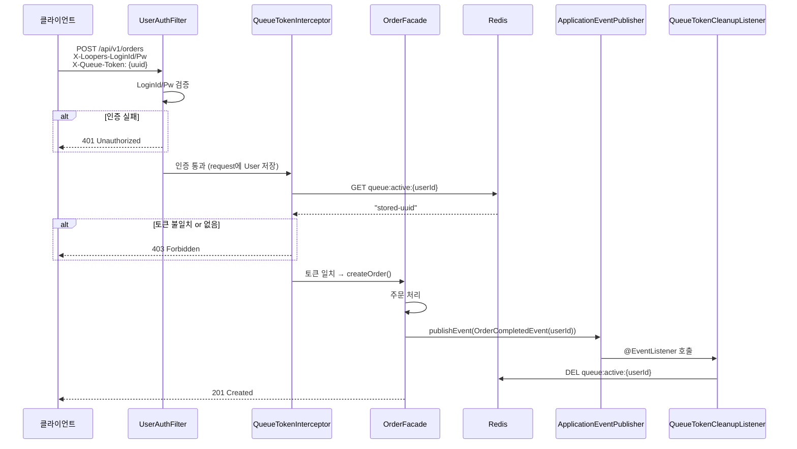

# 대기열(Waiting Queue) 시스템 분석

---

## 1. 대기열이 왜 필요한가

선착순 구매처럼 트래픽이 특정 순간에 폭발적으로 몰리면, 모든 요청이 동시에 DB 커넥션을 잡으려 하다가 커넥션 풀이 고갈된다. 대기열은 이 문제를 "입장 순서를 정해서 N명씩 처리"로 바꿔준다.

```
[문제 상황]
1만 명 동시 요청 → DB 커넥션 10개 → 모두 대기 → timeout 폭발

[대기열 적용 후]
1만 명 → Redis 대기열에 순번 저장 → 30명씩 입장 승인 → DB 30개 요청만 처리
```

---

## 2. 핵심 개념: Redis Sorted Set

```
ZADD waiting-queue {입장요청시각(Unix timestamp ms)} {userId}

예시:
ZADD waiting-queue 1720000001 "1"
ZADD waiting-queue 1720000002 "2"
ZADD waiting-queue 1720000003 "3"
```

- `score` = 입장 요청 시각 → 먼저 온 사람이 작은 score → ZRANK로 순번 조회 (0-based)
- `value` = userId

| Redis 명령어 | 역할 |
|---|---|
| `ZADD` | 대기열 진입. 재진입 시 score 갱신 → 줄 맨 뒤로 밀림 |
| `ZRANK` | 내 순번 조회 (0-based, 없으면 null) |
| `ZCARD` | 전체 대기 인원 수 |
| `ZPOPMIN n` | 앞에서 n명 꺼내기 (스케줄러가 입장 토큰 발급할 때) |
| `SET key EX ttl` | 활성 토큰 저장 (입장 허가) |
| `GET key` | 활성 토큰 값(UUID) 조회 |
| `DEL key` | 주문 완료 후 토큰 삭제 |

---

## 3. Lua 스크립트로 원자적 연산 보장

Redis 명령어는 각각 원자적이지만, **여러 명령을 묶어야 하는 연산**은 중간에 다른 요청이 끼어들 수 있다. Lua 스크립트는 이 명령 묶음 전체를 Redis 내부에서 싱글 스레드로 실행시켜 원자성을 보장한다.

### 3-1. 대기열 진입 Lua (enter)

**왜 필요한가?**
ZADD + ZRANK + ZCARD를 따로 3번 호출하면 ZADD와 ZRANK 사이에 다른 사람이 진입해서 순번이 달라질 수 있다. 순번 반환까지 원자적으로 묶어야 한다.

```lua
-- KEYS[1] : "queue:waiting"
-- ARGV[1] : userId (string)
-- ARGV[2] : score (현재 Unix timestamp milliseconds)

-- 재진입 시 score 갱신 → 줄 맨 뒤로 밀림 (의도된 동작)
redis.call('ZADD', KEYS[1], ARGV[2], ARGV[1])

local rank  = redis.call('ZRANK', KEYS[1], ARGV[1])
local total = redis.call('ZCARD', KEYS[1])

return {rank, total}
```

> **Step 1 체크리스트**
> - [x] Redis Sorted Set 기반 대기열 진입 API 구현 (`POST /queue/enter`)
> - [x] userId 기반 중복 진입 방지 (Sorted Set member 중복 불허, 재진입 시 score 갱신으로 뒤로 밀림)
> - [x] 전체 대기 인원 조회 (ZCARD)

### 3-2. 스케줄러 입장 토큰 발급

ZPOPMIN은 그 자체로 원자적이라 한 번 꺼낸 userId는 다른 누가 가져갈 수 없다. SET은 userId마다 별개 연산이므로 Lua로 묶지 않는다.

```
1. ZPOPMIN queue:waiting N명
2. 각 userId마다:
   a. 0~300ms Jitter delay (동시에 몰리는 주문 API 호출 분산)
   b. UUID 생성
   c. SET queue:active:{userId} {uuid} EX {ttl}
```

```java
List<Long> userIds = queueRepository.popOldest(batchSize);
for (Long userId : userIds) {
    long jitterMillis = ThreadLocalRandom.current().nextLong(0, 301);
    Thread.sleep(jitterMillis);
    String token = UUID.randomUUID().toString();
    entryTokenRepository.save(userId, token, tokenTtlSeconds);
}
```

> **Step 2 체크리스트**
> - [x] 스케줄러가 주기적으로 대기열에서 N명을 꺼내 입장 토큰 발급
> - [x] 토큰 TTL 설정 (`SET EX` + `QueueProperties.tokenTtlSeconds`)
> - [x] 처리량 기준으로 스케줄러 배치 크기 산정 근거 문서화 → §6 QueueProperties 참조

### 3-3. 순번 조회 Lua (position)

**왜 필요한가?**
ZRANK + ZCARD를 따로 2번 호출하면 두 호출 사이에 다른 사람이 입장해 카운트가 달라질 수 있다. 원자적으로 묶어야 한다.

토큰 조회는 이 Lua 스크립트에 포함하지 않는다. 스케줄러가 `ZPOPMIN`으로 유저를 꺼내는 순간 대기열에서 이미 사라지므로, 토큰 체크와 순번 조회는 서로 독립적인 연산이다. `QueueService`에서 두 Repository를 순서대로 호출해 상태를 결정한다.

```lua
-- KEYS[1] : "queue:waiting"
-- ARGV[1] : userId
-- returns: {-1} if not in queue, {rank(0-based), totalWaiting} if waiting

local rank = redis.call('ZRANK', KEYS[1], ARGV[1])
if rank == false then return {-1} end
local total = redis.call('ZCARD', KEYS[1])
return {rank, total}
```

> **Step 1 체크리스트**
> - [ ] 순번 조회 API 구현 (`GET /queue/position`)

---

## 4. 전체 플로우 다이어그램

### 4-1. 대기열 진입 (`POST /api/v1/queue/enter`)

```
클라이언트                 QueueController          Redis
    │                           │                     │
    │  POST /api/v1/queue/enter  │                     │
    │ ─────────────────────────> │                     │
    │                           │  [Lua: enter]        │
    │                           │  ZADD + ZRANK        │
    │                           │  + ZCARD (원자적)    │
    │                           │ ─────────────────── >│
    │                           │ <── {rank:42,total:100}
    │                           │                     │
    │  { status: WAITING,        │  (rank는 0-based,   │
    │    position: 43,           │   표시는 +1)         │
    │    waitingCount: 100,      │                     │
    │    estimatedWaitSeconds: 86 }  │                     │
    │ <───────────────────────── │                     │
```

### 4-2. 배치 스케줄러 입장 토큰 발급 (매 1초)

```
QueueScheduler                         Redis
      │                                  │
      │  ZPOPMIN queue:waiting N명        │
      │ ──────────────────────────────── >│
      │ <── [userId1, userId2, ..., userN]│
      │                                  │
      │  각 userId별 (순차, Jitter 포함): │
      │    sleep(0~300ms)                 │
      │    uuid = UUID.randomUUID()       │
      │    SET queue:active:{id} {uuid}   │
      │    EX 300                         │
      │ ──────────────────────────────── >│
      │                                  │
```

### 4-3. 순번 폴링 (`GET /api/v1/queue/position`)

`QueueService.getPosition()`은 두 Repository를 순서대로 조회한다:
① `EntryTokenRepository.find()` → 토큰 존재 시 ACTIVE
② `QueueRepository.findPositionSnapshot()` → 대기열 존재 시 WAITING
③ 둘 다 없으면 NOT_IN_QUEUE

```
클라이언트                QueueService          EntryTokenRepo    QueueRepo(Lua)
    │                          │                     │                  │
    │  GET /api/v1/queue/position                     │                  │
    │ ──────────────────────── >│                     │                  │
    │                           │  GET queue:active:{id}                │
    │                           │ ─────────────────── >                  │
    │                           │ <── null (아직 없음)│                  │
    │                           │                     │                  │
    │                           │  ZRANK + ZCARD (Lua)│                  │
    │                           │ ──────────────────────────────────── > │
    │                           │ <── {30, 100}       │                  │
    │                           │                     │                  │
    │  { status: WAITING,       │                     │                  │
    │    position: 31,          │                     │                  │
    │    waitingCount: 100,     │                     │                  │
    │    nextPollAfterMs: 2000, │                     │                  │
    │    estimatedWaitSeconds: 62 }                   │                  │
    │ <──────────────────────── │                     │                  │
    │                           │                     │                  │
    │  (2초 뒤 다시 폴링)        │                     │                  │
    │                           │                     │                  │
    │  GET /api/v1/queue/position                     │                  │
    │ ──────────────────────── >│                     │                  │
    │                           │  GET queue:active:{id}                │
    │                           │ ─────────────────── >                  │
    │                           │ <── "uuid-token"    │  ← 스케줄러가 발급│
    │                           │                     │                  │
    │  { status: ACTIVE,        │                     │                  │
    │    entryToken: "550e8400-e29b-41d4-a716-446655440000" }
    │ <──────────────────────── │                     │                  │
    │                           │                     │                  │
    │  (이제 주문 API 호출 가능)  │                     │                  │
```

> **Step 3 체크리스트**
> - [x] Polling 기반 순번 + 예상 대기 시간 응답
> - [x] 토큰 발급 시 (`status: ACTIVE`) 순번 조회 응답에 입장 가능 상태 포함
> - [x] 예상 대기 시간 계산 로직 구현 → §8 참조

### 4-4. 주문 토큰 검증 및 삭제



> 토큰 삭제(`DEL`)가 실패하더라도 `tokenTtlSeconds(300s)` 후 자동 만료된다.

> **Step 2 체크리스트**
> - [x] 주문 API 진입 시 토큰 검증 (`QueueTokenInterceptor` → `POST /api/v1/orders`)
> - [x] 주문 완료 후 토큰 삭제 (`OrderCompletedEvent` → `QueueTokenCleanupListener`)

---

## 5. 컴포넌트 구조

```
apps/commerce-api/src/main/java/com/loopers/
├── domain/queue/
│   ├── QueueRepository.java        — enter / findPositionSnapshot 인터페이스
│   ├── EntryTokenRepository.java   — save / find / delete 인터페이스
│   ├── QueuePositionSnapshot.java  — rank(0-based), totalWaiting record
│   └── QueueStatus.java            — WAITING / ACTIVE / NOT_IN_QUEUE
│
├── infrastructure/queue/
│   ├── RedisQueueRepository.java       — Lua: enter(ZADD+ZRANK+ZCARD), findPositionSnapshot(ZRANK+ZCARD)
│   ├── RedisEntryTokenRepository.java  — opsForValue GET/SET EX/DEL (queue:active:{userId})
│   └── QueueLuaScripts.java            — Lua 스크립트 상수 정의
│
├── application/queue/
│   ├── QueueService.java         — enter / getPosition
│   ├── QueueScheduler.java       — @Scheduled, 1초마다 ZPOPMIN + 입장 토큰 발급
│   ├── QueueEntry.java           — status, position, waitingCount, estimatedWaitSeconds
│   ├── QueuePosition.java        — status, position, waitingCount, nextPollAfterMs, estimatedWaitSeconds, entryToken
│   └── QueueProperties.java      — @ConfigurationProperties(prefix = "queue")
│
├── interfaces/api/queue/
│   ├── QueueV1Controller.java    — POST /api/v1/queue/enter, GET /api/v1/queue/position
│   ├── QueueV1Dto.java
│   ├── QueueTokenInterceptor.java — /api/v1/orders/** 가드
│   └── QueueErrorType.java
│
└── application/order/
    ├── OrderCompletedEvent.java          — record(userId)
    └── QueueTokenCleanupListener.java    — @EventListener
```

---

## 6. 핵심 클래스 설계

### QueueService

```java
QueueEntry enter(Long userId);          // 대기열 진입, 재진입 시 줄 맨 뒤
QueuePosition getPosition(Long userId); // ① 토큰 조회 → ② 순번 조회 → ③ NOT_IN_QUEUE
```

```java
// getPosition 내부 로직
return entryTokenRepository.find(userId)                  // ① ACTIVE?
    .map(token -> new QueuePosition(ACTIVE, ..., token))
    .orElseGet(() -> queueRepository.findPositionSnapshot(userId)  // ② WAITING?
        .map(snapshot -> new QueuePosition(WAITING, ...))
        .orElse(new QueuePosition(NOT_IN_QUEUE, ...))        // ③
    );
```

### QueueEntry / QueuePosition

```java
record QueueEntry(
    QueueStatus status,       // WAITING or ACTIVE
    long position,            // 1-based 순번
    long waitingCount,
    long estimatedWaitSeconds
) {}

record QueuePosition(
    QueueStatus status,
    long position,
    long waitingCount,
    long nextPollAfterMs,     // 클라이언트 다음 폴링 간격 힌트
    long estimatedWaitSeconds,
    String entryToken         // ACTIVE일 때만 non-null, WAITING/NOT_IN_QUEUE는 null
) {}
```

### QueueProperties

```yaml
queue:
  enabled: true
  batch-size: 75           # 1초당 입장 허가 인원 (산정 근거 아래 참조)
  scheduler-interval-ms: 1000
  token-ttl-seconds: 300   # 활성 토큰 유효 시간 (5분)
  max-waiting-size: 100000
```

> **배치 크기 산정 근거**
>
> ---
>
> #### 1단계. 기준 지표 선택 — 왜 avg가 아닌 p95인가
>
> 대기열이 열리는 순간은 트래픽이 가장 폭발적으로 몰리는 시점이다.
> 이 때는 DB 경합, 락 대기, 커넥션 풀 경쟁이 모두 겹쳐 처리 시간이 평소보다 길어진다.
>
> - **avg(231ms)** 는 부하가 낮을 때의 빠른 요청들이 포함되어 있어 실제보다 낙관적이다.
> - **p95(371ms)** 는 "100개 요청 중 95개가 이 시간 안에 끝난다"는 의미로,
>   트래픽 스파이크 상황에서도 커넥션 풀이 감당할 수 있는 처리량의 현실적 하한이다.
>
> batchSize를 avg 기준으로 높게 잡으면, 트래픽이 몰릴 때 실제 처리 속도보다 더 많은 인원을
> 입장시켜 커넥션 풀이 포화되는 역효과가 생긴다.
>
> ---
>
> #### 2단계. k6 실측 결과 (VUs=40, duration=30s)
>
> | 지표 | 값 |
> |---|---|
> | avg | 231ms |
> | p50 | 221ms |
> | p90 | 332ms |
> | **p95** | **371ms** ← 기준 채택 |
> | max | 645ms |
> | 처리량 | 173 orders/s |
> | 에러율 | 0% |
>
> `OrderFacade.createOrder()` 트랜잭션 내 DB 연산 (1상품 기준):
> 1. SELECT product
> 2. SELECT FOR UPDATE product_stock
> 3. UPDATE product_stock
> 4. INSERT order
> 5. INSERT order_item
>
> ---
>
> #### 3단계. 공식 및 계산
>
> ```
> 실효 TPS   = 커넥션 풀 수 / (기준 처리 시간(ms) / 1000)
> 대기열 TPS = 실효 TPS × 커넥션 할당 비율
> batchSize  = 대기열 TPS × (스케줄러 주기(ms) / 1000)
> ```
>
> **커넥션 할당 비율(70%)이 필요한 이유**
> 풀 40개를 주문에 100% 쓰면 상품 조회·유저 인증 등 다른 API에 커넥션이 없어 전체가 터짐.
> 나머지 30% (12개)는 조회성 API용으로 예약.
>
> **p95 기준 계산**
> ```
> 실효 TPS   = 40 / (371 / 1000)
>            = 40 / 0.371
>            ≈ 107.8 TPS
>
> 대기열 TPS = 107.8 × 0.7
>            ≈ 75.5 TPS
>
> batchSize  = 75.5 × (1000 / 1000)
>            = 75.5
>            → 75명/틱  (소수점 내림, 보수적 선택)
> ```
>
> ---
>
> #### 4단계. avg vs p95 비교
>
> | 기준 | 처리 시간 | 실효 TPS | × 70% | batchSize |
> |---|---|---|---|---|
> | avg | 231ms | 173 | 121 | **121명/틱** |
> | p90 | 332ms | 120 | 84 | **84명/틱** |
> | **p95** | **371ms** | **108** | **75** | **75명/틱** ← 채택 |
>
> p95 기준 75명/틱은 avg 기준보다 38% 보수적이다.
> 트래픽 스파이크 구간에서도 커넥션 풀을 70% 이내로 유지할 수 있다.
>
> ---
>
> #### 5단계. 트레이드오프
>
> batchSize를 낮추면 커넥션 풀 안정성이 올라가지만 유저 대기 시간이 늘어난다.
>
> | 항목 | avg 기준(121) | p95 기준(75) |
> |---|---|---|
> | 1000번째 유저 예상 대기 | ≈ 9초 | ≈ 14초 |
> | 커넥션 풀 여유 | 낮음 | 높음 |
> | 스파이크 시 오버로드 위험 | 있음 | 낮음 |

> **Step 2 체크리스트**
> - [x] 처리량 기준(DB 커넥션 풀, 평균 처리 시간)으로 스케줄러 배치 크기 산정 근거 문서화

### QueueLuaScripts

```java
public final class QueueLuaScripts {

    // KEYS[1]: "queue:waiting", ARGV[1]: userId, ARGV[2]: score
    // returns: {rank(0-based), totalCount}
    public static final String ENTER = """
        redis.call('ZADD', KEYS[1], ARGV[2], ARGV[1])
        local rank  = redis.call('ZRANK', KEYS[1], ARGV[1])
        local total = redis.call('ZCARD', KEYS[1])
        return {rank, total}
        """;

    // KEYS[1]: "queue:waiting", ARGV[1]: userId
    // returns: {-1} if not in queue, {rank(0-based), totalWaiting} if waiting
    public static final String POSITION = """
        local rank = redis.call('ZRANK', KEYS[1], ARGV[1])
        if rank == false then return {-1} end
        local total = redis.call('ZCARD', KEYS[1])
        return {rank, total}
        """;

    private QueueLuaScripts() {}
}
```

### Polling 주기 동적 조절 (Nice-To-Have)

순번이 멀수록 폴링 간격을 늘려 서버 부하를 줄인다.

```
position 500+  → nextPollAfterMs = 10,000 (10초)
position 100+  → nextPollAfterMs = 5,000  (5초)
position 30+   → nextPollAfterMs = 2,000  (2초)
position 1~29  → nextPollAfterMs = 1,000  (1초)
```

> **Step 3 체크리스트 (Nice-To-Have)**
> - [x] Polling 주기 동적 조절 (순번 구간별)

---

## 7. Redis Key 설계

| Key | 형태 | 설명 |
|---|---|---|
| `queue:waiting` | Sorted Set | score = 입장 시각 (ms), member = userId |
| `queue:active:{userId}` | String | 값 = UUID 토큰, TTL = 300초 |

---

## 8. 예상 대기 시간 계산

```
예상 대기 시간(초) = position / batchSize × (schedulerIntervalMs / 1000)

예시:
- position: 363 (1-based)
- batchSize: 75명/틱
- schedulerIntervalMs: 1000ms

→ 363 / 75 × 1 = 4.84 ≈ 5초
```

> **Step 3 체크리스트**
> - [x] 예상 대기 시간 계산 로직 구현

---

## 9. 구현 순서

```
Phase 1. 도메인 + Redis  ✅ 완료
  ├── QueueStatus enum
  ├── QueuePositionSnapshot record
  ├── QueueRepository 인터페이스 (enter / findPositionSnapshot)
  ├── EntryTokenRepository 인터페이스 (save / find / delete)
  ├── QueueLuaScripts 상수 클래스
  ├── RedisQueueRepository (Lua: enter, findPositionSnapshot)
  └── RedisEntryTokenRepository (opsForValue GET/SET/DEL)

Phase 2. Application + API  ✅ 완료
  ├── QueueEntry, QueuePosition record (application/queue)
  ├── QueueService (enter / getPosition)
  ├── QueueV1Dto (EnterResponse / PositionResponse+entryToken)
  └── QueueV1Controller (POST /enter, GET /position)

Phase 3. 주문 가드  ✅ 완료
  ├── OrderCompletedEvent record
  ├── QueueTokenCleanupListener @EventListener (entryTokenRepository.delete)
  ├── QueueTokenInterceptor (X-Queue-Token 헤더 검증)
  └── WebMvcConfig에 POST /api/v1/orders 인터셉터 등록

Phase 4. 스케줄러 + 설정  ✅ 완료
  ├── QueueProperties @ConfigurationProperties
  └── QueueScheduler @Scheduled (ZPOPMIN → entryTokenRepository.save)

Phase 5. (Nice-To-Have) Polling 주기 동적 조절  ✅ 완료
  └── QueuePosition.nextPollAfterMs 구간별 계산
```
